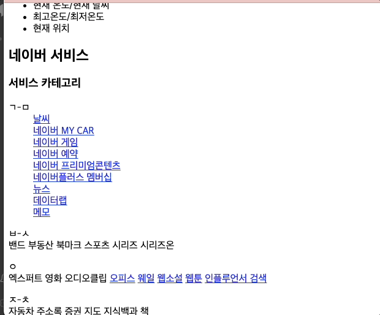
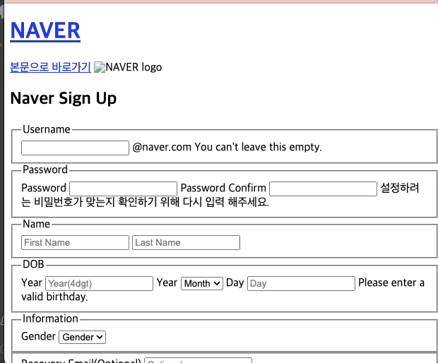
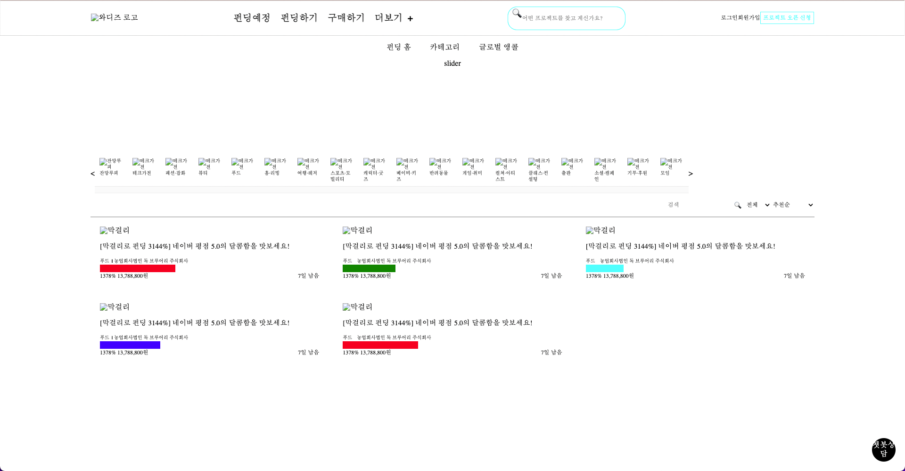
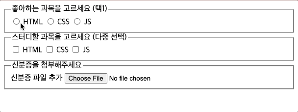
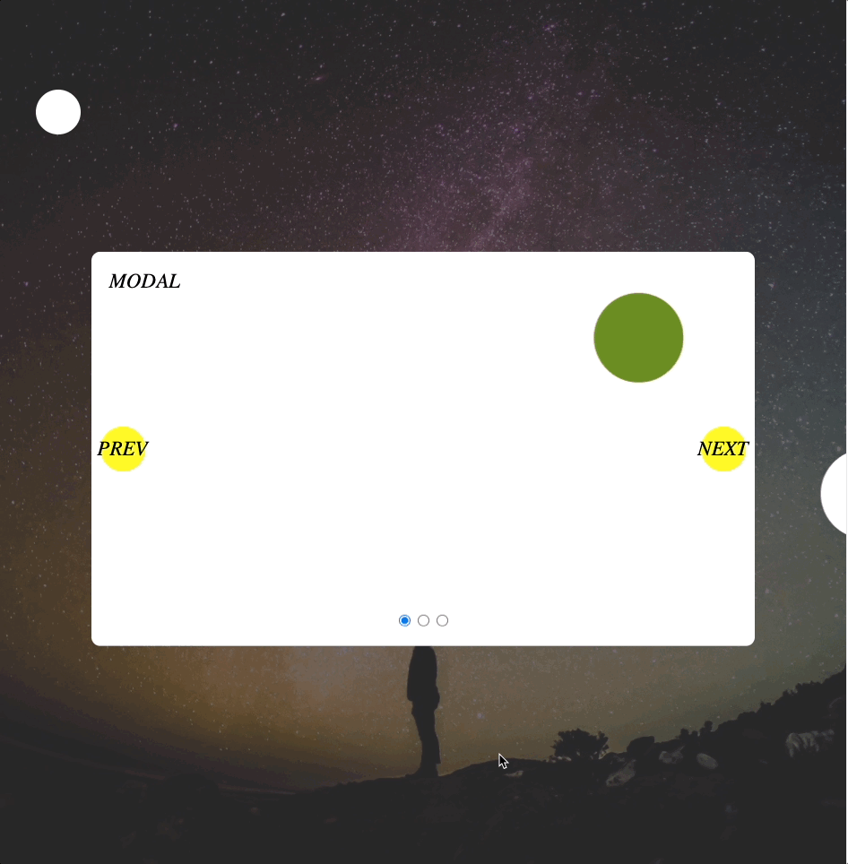
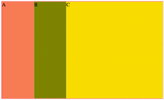
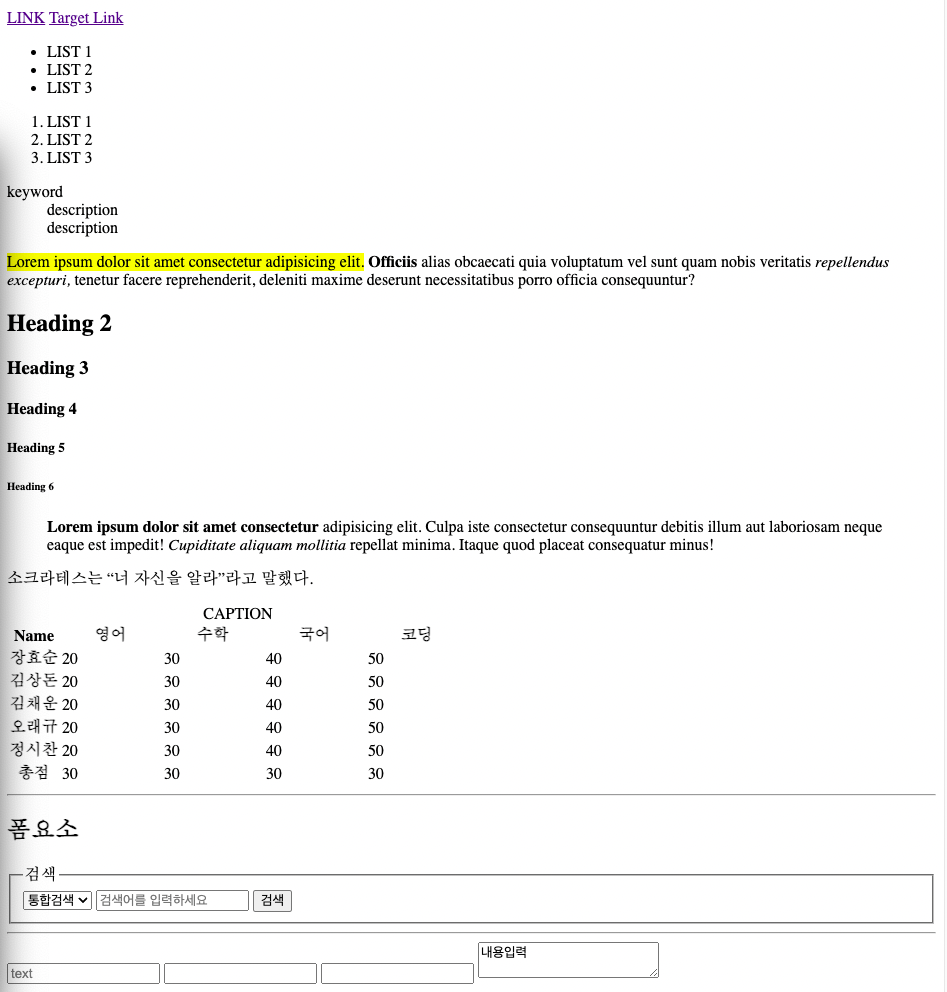

<h1>Publishing Study (21.12.30 ~ 22.01.25)</h1>

<header>
  <ul>
    <li>
      Topic : 홈페이지 클론 퍼블리싱 스터디
    </li>
    <li>
      Language : HTML, CSS, JavaScript
    </li>
   <li>
      Leader : 남은정 멘토님
    </li>
    <li>
      Member : 멋쟁이 사자처럼 프론트엔드 1기 동기들
    </li>
  </ul>
</header>
 
<nav style="margin-top:30px;">
  <table style="width: 80%;">
    <thead>
      <tr>
        <th colspan="3" style="background:black;color:white;text-align:center;">Study Contents</th>
      </tr>
    </thead>
    <tbody>
      <tr>
        <th>Index</th>
        <th>What I Studied</th>
        <th>My Project</th>
      </tr>
      <tr>
        <td>1회차 (12/30)</td>
        <td>
          <a href="#1">HTML Semantic MarkUp (1)</a>
        </td>
        <td>
          <a href="https://jiseung-kang.github.io/Publishing-Study/google/google.html">Google</a>
        </td>
      </tr>
      <tr>
        <td>2회차 (01/02)</td>
        <td>
          <a href="#2">HTML Semantic MarkUp (2)</a>
        </td>
        <td>
          <a href="https://jiseung-kang.github.io/Publishing-Study/naver/naver_home.html">NAVER 메인페이지</a>
          <a href="https://jiseung-kang.github.io/Publishing-Study/naver/naver_agree.html">NAVER 약관동의</a>
          <a href="https://jiseung-kang.github.io/Publishing-Study/naver/naver_info.html">NAVER 회원가입</a>
        </td>
      </tr>
      <tr>
        <td>3회차 (01/04)</td>
        <td>
          <a href="#3">HTML Semantic MarkUp (3)</a>
        </td>
        <td>
          <a href="https://jiseung-kang.github.io/Publishing-Study/wadiz/wadiz.html">wadiz 펀딩페이지</a> 
          <a href="https://jiseung-kang.github.io/Publishing-Study/form/form.html">Form CSS 연습</a> 
        </td>
      </tr>
      <tr>
        <td>4회차 (01/06)</td>
        <td>
          <a href="#4">CSS</a>
        </td>
        <td>
          <a href="https://jiseung-kang.github.io/Publishing-Study/modal/modal.html">CSS 연습</a>
        </td>
      </tr>
      <tr>
        <td>5회차 (01/09)</td>
        <td>
          <a href="#5">CSS, SASS</a>
        </td>
        <td>
          <a href="https://jiseung-kang.github.io/Publishing-Study/SASS/index.html">Reset 연습</a> 
          <a href="https://jiseung-kang.github.io/Publishing-Study/SASS/target.html">Form SASS 연습</a> 
        </td>
      </tr>
    </tbody>
  </table>
</nav>

  <h2>1회차 : Google Clone, HTML Semantic MarkUp</h2>
  - 레퍼런스 이미지
  
  - <a href="https://jiseung-kang.github.io/Publishing-Study/google/google.html">구글 과제</a> 미리보기
  

  

    <h3>Project Feedback</h3>
    <ul>
      <li>main 태그 안에 header, footer 태그가 들어가지 않는다. </li>
      <li>input 태그에 type="search" 활용하기 </li>
      <li>form 태그 사용시 fieldset, legend 활용하기</li>
    </ul>
  

  

    <h3>Study</h3>
    <ul>
      <li>로그인 구현시 고려되어야 할 항목들
        <ul>
          <li>로그인</li>
          <li>회원가입</li>
          <li>아이디/비밀번호찾기</li>
          <li>개인정보 입력</li>
          <li>로그아웃</li>
          <li>회원탈퇴</li>
          <li><b>로그인 전 (로그인 필요)</b></li>
          <li><b>로그인 후 (마이페이지 등)</b></li>
        </ul>
      </li>
      <li>!DOCTYPE : HTML5를 사용한다는 DTD 선언</li>
      <li>block요소와 inline요소의 사용
        <ul>
          <li>block 요소 안에 inline 요소를 사용할 수 있다.</li>
          <li>inline 요소 안에 쓸 수 없는 block 요소가 있다.</li>
        </ul>
      </li>
      <li>label의 종류(명시적(for), 암시적)</li>
      <li>DOM Tree 구조(부모-자식 관계 / 형제 관계 구분하기)</li>
    </ul>
  

  

    <h2>2회차 : Naver Clone, HTML Semantic MarkUp</h2>
      - <a href="https://jiseung-kang.github.io/Publishing-Study/naver/naver_home.html">네이버 메인 페이지 과제</a> 미리보기 
       
      - <a href="https://jiseung-kang.github.io/Publishing-Study/naver/agree.html">네이버 개인정보 동의페이지 과제</a> 미리보기 
       
      - <a href="https://jiseung-kang.github.io/Publishing-Study/naver/naver_info.html">네이버 개인정보 과제</a> 미리보기 
  
    

      <h3>Project Feedback</h3>
      <ul>
      </ul>
    

    

      <h3>Study</h3>
      <ul>
        <li>form 태그
          <ul>
            <li>종류: button. a, input</li>
            <li>submit : form태그 안의 내용이 한번에 전송된다.</li>
          </ul>
        <li>
        <li> IE 사용 고려, role로 역할부여하여 semantic한 태그 구성하기
          <ul>
            <li>main role="main</li>
            <li>a role="button</li>
          </ul>
        </li>
        <li></li>
        <li>nav : 책갈피. 도메인이 변경되는 링크들의 묶음에 대해서는 지양하기</li>
        <li>dl, dt, dd 적정하게 활용하기</li>
        <li>HTML 지식</li>
          <ul>
            <li>HyperText Markup Language</li>
            <li>Web Standards : W3C<=>WHATWG</li>
            <li>contenteditable : true => 편집 가능</li>
            <li>SVG : XML</li>
          </ul>
      </ul>
    

  

  

  <h2>3회차 : Wadiz Clone, HTML Semantic MarkUp</h2>
  - <a href="https://jiseung-kang.github.io/Publishing-Study/wadiz/wadiz.html">와디즈 과제</a> 미리보기
  
  - <a href="https://jiseung-kang.github.io/Publishing-Study/form/form.html">Form 과제</a> 미리보기  
  
  

    <h3>Project Feedback</h3>
    <ul>
      <li>blind처리, 그러나 스크린리더가 읽게 하고 싶을 때 방법 예시: font-size:1px; color:transparent; 이런 식으로 처리할 수도 있다. 다만 width:0px; height:0px; font-size:0px의 경우 마크업 처리되지 않는다. </li>
    </ul>
  

  

    <h3>Study</h3>
    <ul>
      <li><a href="https://jiseung-kang.github.io/Publishing-Study/Study/0104_position.html">position 연습</a></li>
      <li>가운데 정렬: block, flex는 margin으로 정렬</li>
      <li>margin auto 남는 영역을 나눠 가진다.</li>
      <li>inline은 크기를 지정할 수 없다. 상하 여백(padding, margin) 불가능</li>
    </ul>
  

  

    <h2>4회차 : CSS </h2>
    - <a href="https://jiseung-kang.github.io/Publishing-Study/modal/modal.html">모달 과제</a> 미리보기
  
    

      <h3>Project Feedback</h3>
      <ul>
        <li>부모 자식 관계에 유의한 position 설정하기</li>
        <li>width값은 꼭 필요할 때만 설정하기. 100% 남용하지 않기</li>
      </ul>
    

    

      <h3>Study</h3>
      <ul>
        <li><a href="https://jiseung-kang.github.io/Publishing-Study/flex/flex.html">Flex, Multi Properties 실습</a></li>
        <li><a href="https://jiseung-kang.github.io/Publishing-Study/flex/flex_test.html">Flex 실습</a></li>
        <li>flex-grow : 기본값은 0. flex 정렬시 여백을 꽉 채우고 싶을 때. 남은 영역에 대해 나눠 갖는 정도</li>
        <li></li>
        <li>flex-shrink : 넘쳐서 overflow상황일 때, 기본값은 1. 더 줄어들어도 되는 정도</li>
        <li>flex-basis : flex 진행 방향으로의 크기</li>
        <li>축약형은 유의해서 쓰기 : 특히 가상 선택자에서 원하는 속성을 명확하게 명시하기. ex) background-color</li>
      </ul>
    

  

  

    <h2>5회차 : SASS</h2>
    

      <h3>Study</h3>
      - Reset 전 기본 태그
      
      <ul>
        <li><a href="https://jiseung-kang.github.io/Publishing-Study/SASS/scss/_reset.scss">Reset 연습</a></li>
        <li><a href="https://jiseung-kang.github.io/Publishing-Study/SASS/scss">SASS 연습</a></li>
        <li>SASS(들여쓰기) => SCSS(중괄호)</li>
        <li>sass 변환할 .scss파일:변환되는 .css파일</li>
        <li>sass --watch scss:css</li>
      </ul>
    

  

  <!-- 

    <h2>회차 : </h2>
    

      <h3>Project Feedback</h3>
      <ul>
      </ul>
    

    

      <h3>Study</h3>
      <ul>
      </ul>
    

  
 -->

